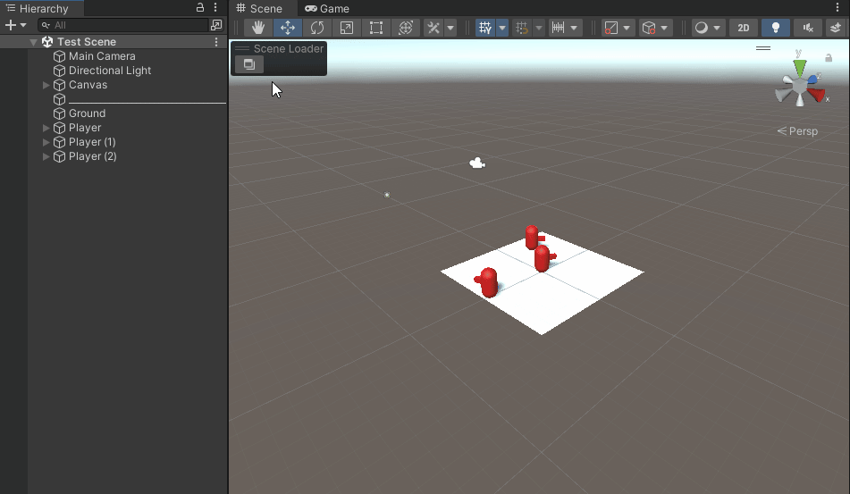

Adds a scrollable window containing a list of Scenes (assignable by the user) that allows to fast load these Scenes (single or additive) without the need to go to them in the project window. If there is a not saved scene, a DisplayBlock will be shown asking to save the scene before removing it.

Add scenes to the list clicking in the ⚙️ (gear) icon.

(2021+) The Scene Loader needs to be set as visible in the overlay window and placed where the user wants. 

(2020-) The Scene Loader can be accessed in the top left corner of the SceneView.

