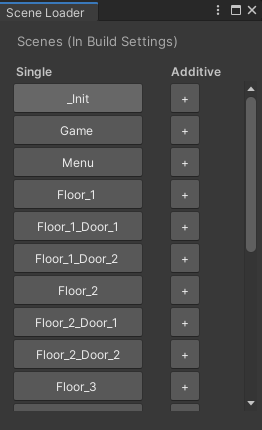

# SceneLoaderUnity
Adds a window option in Unity that allows a fast load of the project scenes (single and additive options). The scenes must be in the Build Settings to be visible. 
You can find the Scene Loader window inside the Scene menu on top screen.

